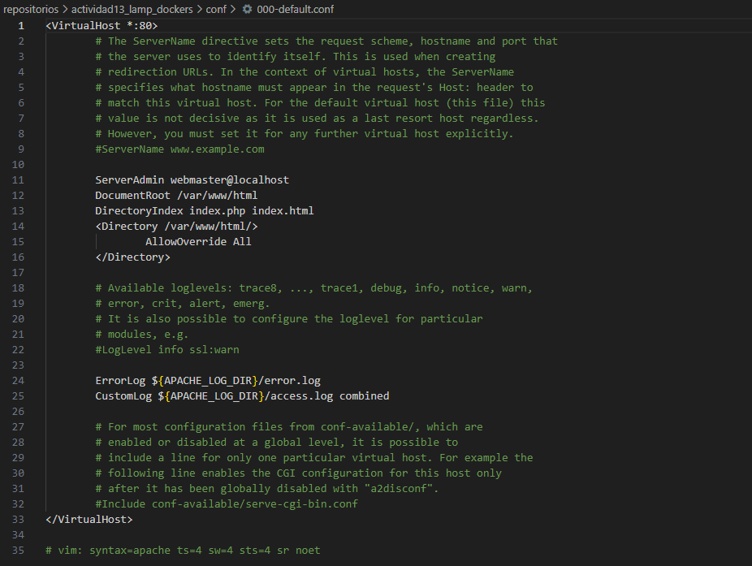
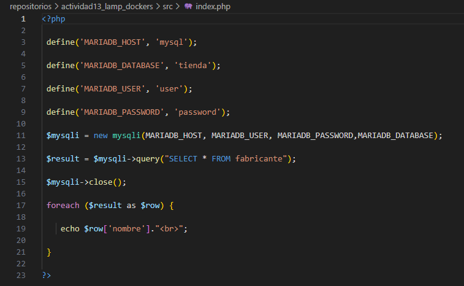
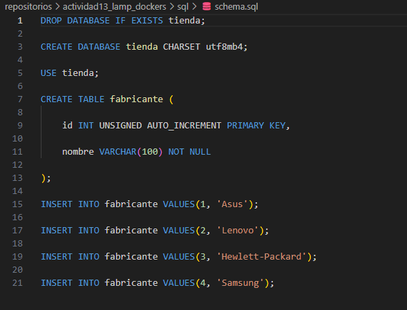
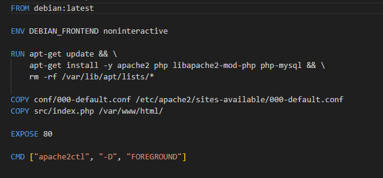
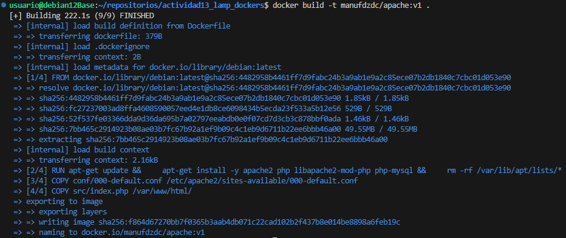
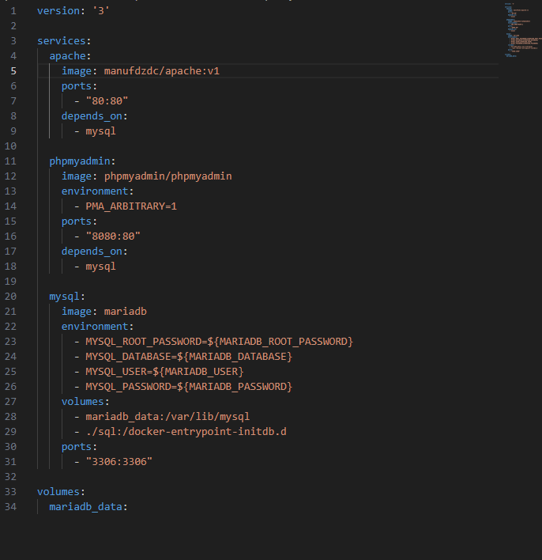
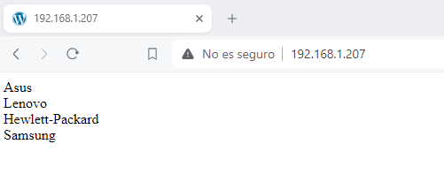
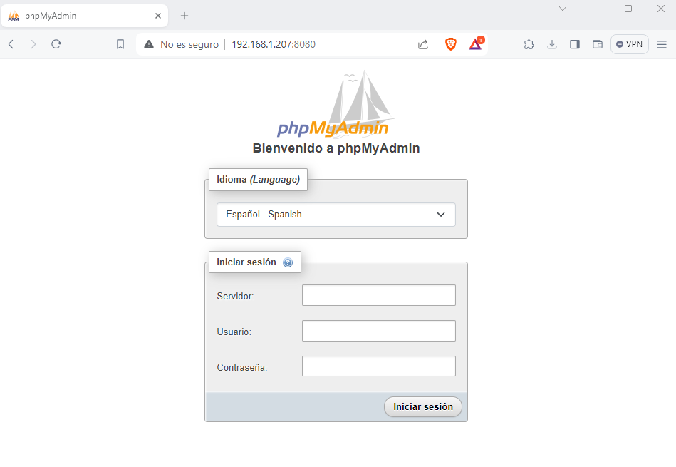

# Creación de un entorno de desarrollo LAMP con una pequeña aplicación WEB

1. Creamos los archivos que necesitaremos para las instrucciones del dockerfile.
    
    
    


2. Creacion del archivo dockerfile.
    

3. Crear la imagen que usaremos en el archivo docker-compose.yml.
    ```
    docker build -t manufdzdc/apache:v1 .
    ```
    

4. Creacion del archivo docker-compose.yml.
    
 
5. Ejecutar la instruccion para usar el contenedor.
    ''' 
    docker compose up 
    ''' 
6. Comprobar que funciona
    
    

### NOTA: Las ips no corresponden con las de clase ya que la tarea la he realizado en casa